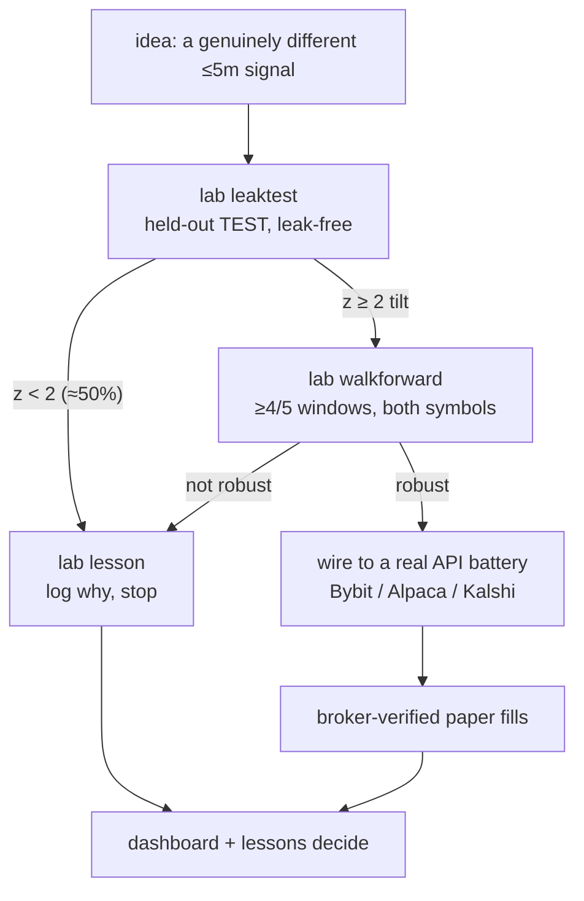
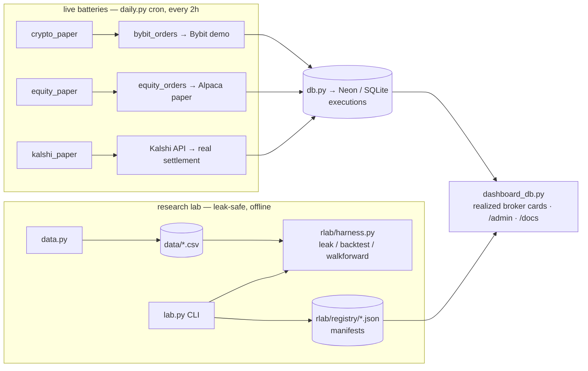

# daily_run — the trading lab's single source of truth

this one doc holds **everything**: the thesis, the rules, the architecture, the
current roster, the research procedure, the infra/deploy reference, and the
do-not-relitigate lessons. if a rule or plan isn't here, it doesn't exist.

`daily_run.md` is canonical; **`daily_run.html` is the browser twin** (also served
live at `/docs`). edit one, mirror the other — keep them in sync on every change.

---

## the honest thesis (read this first)

short-term trading edge basically **isn't out there**. liquid markets are roughly
efficient, so a retail intraday technical edge is brutally hard — not because it's
rigged, but because it's competitive and net-negative after costs. the *industry*
around retail trading (signal sellers, gurus, prop-challenge firms) is mostly a
scam that profits from hope and fees.

so this lab is two things:

- a standing **reminder** that the edge isn't there, and
- a way to **know instead of guess** — a no-lookahead, broker-verified
  falsification machine. its honest output is usually "no edge here," and that's
  the correct, valuable answer.

we still **genuinely keep trying** new ≤5m strategies. most get rejected.
disciplined rejection, recorded in `lessons`, **is the product** — not a failed
run. paper only; no real money is ever at risk.

---

## the hard rules (never cross)

1. **NO LOOKAHEAD (cardinal).** every signal must be computable from data
   available *before* the outcome bar. the harness enforces this — predictions
   are made as_of bar t and scored on bar t+1's independent close. **write the
   leak test first.** if it's ~50% leak-free, it does not work, no matter how
   good the in-sample number looks.
2. **≤5 minutes.** every timeframe is ≤5m (`ZONE_TFS=["5m"]`). no 15m/1h/swing.
3. **API-testable or deleted.** a strategy ships only if it runs on a **real
   broker/exchange API** with broker-confirmed fills & settlement: **Bybit demo**
   (crypto), **Alpaca paper** (equities), **Kalshi demo** (prediction markets).
   no self-resolved bar-replay, no simulators. **Polymarket is OUT** — it has no
   first-party paper API (only mainnet + third-party sims = banned).
4. **verified data only.** the dashboard shows broker-confirmed P&L and win/loss
   — never a paper calc. derived metrics are **realized from fills** (e.g. R:R =
   mean win bps / mean loss bps), never planned geometry.
5. **diversity / no duplicates.** don't keep two near-identical signals (two MAs,
   two volume strategies) unless they're *vastly* different. collapse variants to
   one representative; spend effort on genuinely different families.
6. **paper only.** the live-money path refuses unless someone sets
   `LIVE_BUDGET_ARMED=1`. leave it off.

---

## the loop — how a new idea proves out



the bar to revisit anything in **do-not-relitigate**: a walk-forward positive in
**≥4/5 windows on BOTH symbols, leak-free**. a single test-split number is not
enough.

---

## the daily research run (in order)

0. **orient.** read this doc + `python lab.py lessons` (don't relitigate
   settled-dead ideas). run `python daily.py` so open positions resolve and new
   ones record.
1. **pick a focus** (rotate; don't do all three daily):
   - **A — new research.** find a genuinely *different* ≤5m signal family
     (momentum/trend, breakout, volatility, microstructure/order-flow,
     seasonality, statistical/ML, cross-asset) — **do NOT default to zone/gap.**
     prior-art check ("has anyone done this? arbed away?"). then
     `lab new <name> --venue <bybit_demo|alpaca|kalshi> --symbols ...` → write the
     signal in `rlab/impl/<name>.py` (pure, leak-free) → `lab leaktest` (fail ⇒
     `lab lesson` + stop) → `lab walkforward` (not robust ⇒ `lab lesson`).
   - **B — deepen** a surviving paper strategy: more data, more instruments.
   - **C — dedup / retire** drift: collapse near-duplicates; `lab retire --reason`.
2. **record outcomes.** every rejection → `lab lesson "<idea>" --evidence "..."`.
3. **upkeep (mandatory).** if you changed any infra (a module, table, env var,
   the roster), **update THIS doc (.md + .html) in the same change.**
4. **audit (mandatory).** our numbers must match the venue's truth. run a resolve
   cycle (`python daily.py`) and confirm recorded fills reconcile with Bybit /
   Alpaca before shipping.
5. **ship.** commit + push to `master`, then deploy (see infra below).

---

## lab commands

```
python lab.py list                       lifecycle of every strategy
python lab.py status <name>              manifest + recent ledger
python lab.py lessons                    do-not-repeat memory (READ FIRST)
python lab.py new <name> --venue bybit_demo --symbols BTCUSDT,ETHUSDT
python lab.py leaktest <name>            held-out TEST hit, leak-free (the GATE)
python lab.py backtest <name>            TRAIN/VAL/TEST hit + edge vs baseline
python lab.py walkforward <name>         rolling OOS windows (robust = ≥4/5)
python lab.py gridsearch <name>          sweep param_grid on VALIDATION
python lab.py lesson "<idea>" --evidence "..." [--redo "..."]
python lab.py retire <name> --reason "..."

python data.py BTCUSDT 5m 1m 2025-06 2026-05    # fetch research data (≤5m)
python daily.py                                 # resolve + place real broker orders
python db.py                                     # init/verify the store
```

---

## architecture (current, true)



- **research lab** (this is what "test strategies" means): `data.py` fetches ≤5m
  klines → `rlab/harness.py` runs the leak-free TEST / walk-forward → `lab.py` is
  the CLI → strategies are manifests in `rlab/registry/*.json`. binary/directional
  next-bar edges are what get falsified here.
- **live batteries** (`daily.py`, every 2h): `crypto_paper` places real **Bybit
  demo** 5m brackets across the perp universe; `equity_paper` places real **Alpaca
  paper** 5m orders; `kalshi_paper` scores its vol model against **Kalshi's real
  settlement**. all outcomes are API-verified and land in `executions`.
- **dashboard** (`dashboard_db.py`): public cards sorted by realized P&L, `/admin`
  (auth), and `/docs` (this document).

---

## current roster (4)

| name | venue (real API) | kind | family |
|---|---|---|---|
| `gaptrav_cx_5m` | Bybit demo | bracket | zone/gap — **the one gap** (crypto, 24/7) |
| `meanrev_eq_5m` | Alpaca paper | binary | mean-reversion |
| `wick_fade_eq_5m` | Alpaca paper | binary | wick-fade |
| `kalshi_crypto_model` | Kalshi | binary | prediction-market (vol model vs settlement) |

deduped 2026-06-21: the zone/gap monoculture (gaptrav_tight / far_targets /
meanrev_confluence + all 15m/1h children) collapsed to **one** gaptrav rep, kept on
crypto. non-API strategies (Polymarket `meanrev`, `meanrev_spot`, `clv_*`,
`zone_break_bias`) deleted. `kalshi_crypto_model` scores a driftless-lognormal vol
model against Kalshi's **real finalized settlement** (no orders — paper, API-verified
ground truth). the job now is to **add genuinely different ≤5m families** via the lab.

---

## do-not-relitigate (settled negative)

these were tested thoroughly and failed. the revisit bar is a walk-forward
positive in ≥4/5 windows on BOTH symbols, leak-free — not a single number.

- **gap-traversal far targets (k≥2):** fails walk-forward; a multiple-comparisons
  artifact (RR scales but expectancy doesn't survive).
- **gap-traversal as a single-candle signal:** 49% leak-free next-candle (z=-2.6).
- **wick-rejection fade:** 45–48% on close.
- **zone-break bias:** 50.4%.
- **meanrev (RSI/MFI → Polymarket):** backtested 54–57% but **live paper refuted
  it** (45.9% over 109 bets, worst on the board) → demoted. **trust live paper
  over backtest ranking.**
- **TradingView public ideas:** 180 authors, sub-coinflip and anti-predictive →
  whole pipeline deleted.
- the **"28 R:R"** that triggered this cleanup was a measurement artifact (planned
  bracket geometry with a ~2-tick stop), not edge. metrics are realized-only now.

---

## execution discipline (baked into the live order layers)

hard-won from a full broker audit; these guards live in the order code, not in
strategy logic:

- **validate entry vs live price before placing.** a limit on the wrong side of
  the market fills *marketable* (now), not at the drawn level — stranding a stop
  sized to the intended entry. the equity layer gates on this.
- **min stop distance + min RR.** reject any bracket whose stop sits inside the
  timeframe noise floor or whose RR < ~0.8. this is the *same* failure that
  produced the bogus "28 R:R" — a ~2-tick stop is an instant, meaningless loss.
- **atomic brackets, re-anchored to the fill.** Bybit entries place with TP+SL
  attached at creation and re-anchor to the actual fill (preserves RR); never a
  naked position.

---

## infra / deploy reference

- **GitHub:** `jacesabr/trading_service` @ `master` (public).
- **Neon:** `withered-wind-02493492` / `neondb` (`DATABASE_URL` pooled, us-west-2).
  `db.py` auto-selects Postgres if `DATABASE_URL` is set, else local SQLite.
- **Render (jae workspace):**
  | service | id | role |
  |---|---|---|
  | web `signal-dashboard` | `srv-d8ncr4k8aovs73ab7bb0` | `gunicorn dashboard_db:app` → https://signal-dashboard-3rzj.onrender.com |
  | cron `signal-daily` | `crn-d8o1svjeo5us738btld0` | `python daily.py` every 2h — real Bybit + Alpaca orders |
  | worker `signal-runner` | `srv-d8ncrf3tqb8s73d1q1rg` | **SUSPENDED** (sim retired) |
- **deploy:** auto-deploy is unreliable; after `git push origin master`, trigger
  each affected service:
  ```
  curl -s -X POST -H "Authorization: Bearer $RENDER_API_KEY" \
    "https://api.render.com/v1/services/<service-id>/deploys" -d '{}'
  ```
  redeploy the **dashboard** for manifest/UI changes; the **cron** for battery
  changes.
- **env vars (names only; values in `.env` / `secrets/` / Render):**
  - cron: `DATABASE_URL`, `BYBIT_DEMO_KEY/SECRET`, `BYBIT_DEMO_ORDERS=1`,
    `BYBIT_SIZE_MODE`/`BYBIT_NOTIONAL`, `ALPACA_KEY/SECRET`,
    `ALPACA_EQUITY_ORDERS=1`,
    `ALPACA_EQUITY_STRATEGIES=gaptrav_eq_5m,meanrev_eq_5m,wick_fade_eq_5m`,
    `KALSHI_API_KEY_ID`/`KALSHI_PRIVATE_KEY_PATH`(→`secrets/kalshi_rsa.pem`).
  - dashboard: `DATABASE_URL`, `ADMIN_USER`, `ADMIN_PASSWORD` (gates `/admin`).
- **deps:** `pandas, numpy, flask, gunicorn, psycopg2-binary, scikit-learn,
  cryptography` (`requirements.txt`). add a dep there **and** here.
- **DB tables:** `signals · bets · trades · executions · experiments ·
  strategy_versions · lessons`.

---

## pieces / choices

| piece | choice now | why | later / alternative |
|---|---|---|---|
| timeframe | 5m only | ≤5m mandate; cuts noise/churn from sub-5m | add 1m if a 1m family proves out |
| crypto venue | Bybit demo | real API, %-fee, long+short perps, 24/7 | Hyperliquid / Kraken testnet |
| equity venue | Alpaca paper | real API bracket OCO | — |
| prediction mkt | Kalshi (demo) | real API; Polymarket has none | rebuild the Kalshi engine (pending) |
| research engine | binary/directional leak test + walk-forward | proves an edge existed before the outcome | bracket backtest needs 1m + zones (runs live instead) |
| metrics | realized from broker fills | verified-data rule | — |

---

## next / open

- **add new ≤5m families** — the standing job. zone/gap is the only TA family left
  and it's ~breakeven; the lab exists to find genuinely *different* ones (momentum,
  microstructure, volatility, seasonality, …). most will be rejected — that's the
  point.
- **Kalshi** — wired + verified (vol model vs real settlement, RSA-authed live API);
  now accumulating calls. evaluate calibration once enough have settled.
- **live path** — only worth discussing if something survives walk-forward *and*
  broker-verified paper. the $1 CAD-risk Bybit-perp route is the candidate.
